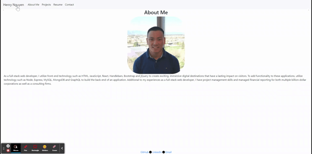

# Portfolio

 

<h3 align="center">Portfolio</h3>

  

    Professional Portfolio
     
  

  
Table of Contents

  <ol>
    <li>
      <a href="#about-the-project">About The Project</a>
      <ul>
        <li><a href="#tools-used">Tools used</a></li>
      </ul>
    </li>
    <li>
      <a href="#instructions">Instructions</a>
        </li>
    <li><a href="#license">License</a></li>
    <li><a href="#contact">Contact</a></li>
  </ol>

## About The Project

This is just a fun page to show a few of my projects. The profile was created using react to modulize each section. I hope you like it! 😃 

(<a href="#top">back to top</a>)

### Tools used

* JavaScript
* React
* Node.js
* CSS
* HTML

(<a href="#top">back to top</a>)

## Instructions

You can view the page here: [here](https://henrynguyen.org). That's about it, thank you taking a look at my portfolio!

(<a href="#top">back to top</a>)

## License

Distributed under the MIT License. See `LICENSE.txt` for more information.

(<a href="#top">back to top</a>)

## Contact

Henry Nguyen -  hln11244@gmail.com

Project Link: [https://henrynguyen.org](https://henrynguyen.org)

(<a href="#top">back to top</a>)

[linkedin-url]: https://www.linkedin.com/in/henry11244/
